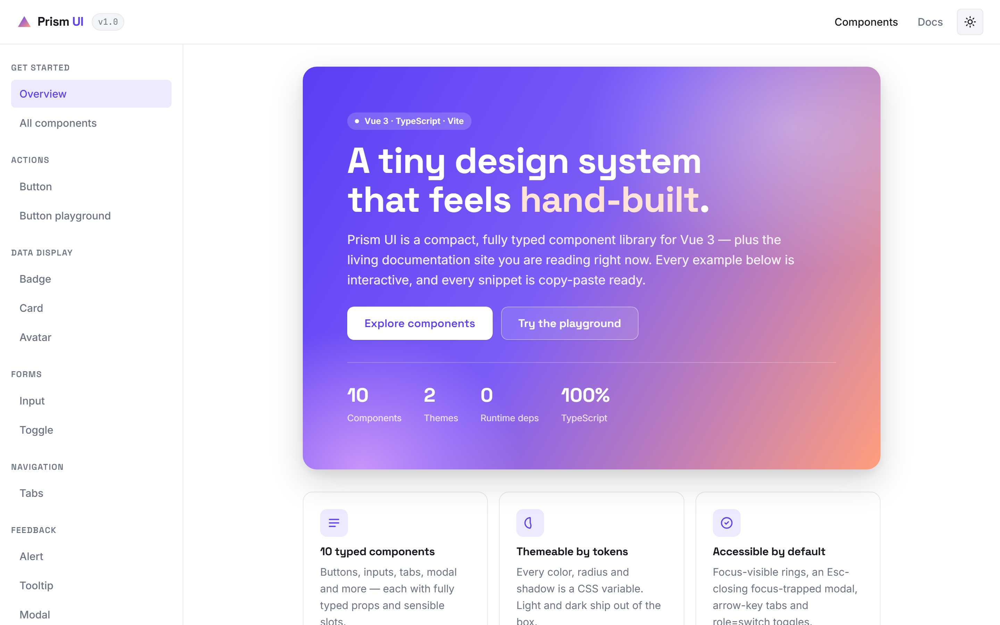

# Prism UI

> A small but real Vue 3 component library — plus the live documentation & showcase site that ships with it.

**Prism UI** is a portfolio project: a compact design system built from scratch to demonstrate clean, typed, accessible component work in Vue 3. There is no Tailwind and no third-party UI kit — every component, token and interaction is hand-written. The documentation site you build and run *is* the product: each component ships with an interactive preview and a copy-paste code snippet, and there is a live Button "playground" that rewrites its own code as you flip props.



> _Portfolio piece — built as a work sample for a frontend role._

## Stack

- **Vue 3** with `<script setup lang="ts">`
- **TypeScript** (strict) with typed props/interfaces for every component
- **Vite** for dev/build
- **Vue Router** — two routes: Overview and Components
- **Plain CSS** with design tokens as CSS custom properties (no CSS framework, zero runtime UI deps)

## Components

All components live in [`src/components/prism/`](src/components/prism) and are re-exported from `src/components/prism/index.ts`.

| Component | Highlights |
| --- | --- |
| **Button** | `primary` / `secondary` / `ghost` / `danger`, sizes `sm`/`md`/`lg`, loading + disabled |
| **Badge** | Five tones, optional status dot |
| **Card** | Header / body / footer / media slots, interactive elevation |
| **Input** | Label, helper text, inline error/validation, prefix/suffix slots |
| **Toggle** | Real `role="switch"`, keyboard operable |
| **Tabs** | Roving-tabindex, arrow / Home / End keyboard navigation |
| **Avatar** | Image with deterministic colored initials fallback + presence dot |
| **Alert** | `info` / `success` / `warning` / `danger`, icons, dismissible |
| **Tooltip** | Hover + focus triggered, four placements |
| **Modal** | `<Teleport>`, focus trap, Esc to close, focus restore on exit |

## Getting started

```bash
npm install
npm run dev
```

Then open the printed local URL (default `http://localhost:5173`).

Other scripts:

```bash
npm run build     # type-check with vue-tsc + production build
npm run preview   # preview the production build
```

## Design notes

The visual direction is a crisp, confident developer-tool aesthetic — deliberately *not* the default "cream + serif + terracotta" look.

- **Palette.** A white canvas with a soft `#F4F5F8` surface, near-black ink, and a **violet `#5B3DF5`** primary. A **peach `#FF9E7D`** accent appears sparingly, and a single violet→peach gradient is reserved for exactly one hero moment on the Overview page.
- **Typography.** `Space Grotesk` for display/headings (techy and precise), `Inter` for body copy, and `JetBrains Mono` for code snippets — a clear three-role type scale.
- **Theming.** Every color, radius, shadow and spacing value is a CSS variable. A working light/dark toggle in the top bar flips a single `data-theme` attribute and the whole system re-themes; the choice is persisted and respects the OS preference on first load.
- **Signature moment.** The Button *playground* at the top of the Components page: real controls for variant, size, loading, disabled and label drive both a live preview and a generated code snippet that updates in real time.
- **Accessibility.** Visible focus rings via `:focus-visible`, a focus-trapped Esc-closing modal that restores focus, arrow-key tab navigation, a genuine switch toggle, and full `prefers-reduced-motion` support.

## Project structure

```
src/
  components/
    prism/      # the component library (Button, Modal, …) + index.ts
    docs/       # showcase shell: Topbar, Sidebar, CodeBlock, Preview, DocSection
  composables/  # useTheme, useClipboard
  router/       # Overview + Components routes
  styles/       # tokens.css (design tokens) + base.css
  views/        # Overview.vue, Components.vue
```

## TODO

- Add a real screenshot at `docs/screenshot.png` (referenced above).
